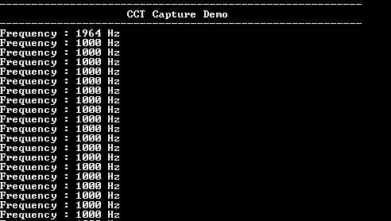

# CCT Capture mode

This example application demonstrates how to use the Input Capture and Compare Timer peripheral in capture mode.

## Description

This example application demonstrates how to use the Input Capture and Compare Timer peripheral in capture mode. A PWM signal is generated and fed as input to the input capture module. The input capture module is configured to generate an interrupt on falling edge of the input signal. The demo calculates and displays the frequency of the input signal on to the console.

## Downloading and building the application

To clone or download this application from Github, go to the [main page of this repository](https://github.com/Microchip-MPLAB-Harmony/csp_apps_cec173x) and then click **Clone** button to clone this repository or download as zip file.
This content can also be downloaded using content manager by following these [instructions](https://github.com/Microchip-MPLAB-Harmony/contentmanager/wiki).

Path of the application within the repository is **apps/cct/cct_capture_mode/firmware** .

To build the application, refer to the following table and open the project using its IDE.

| Project Name      | Description                                    |
| ----------------- | ---------------------------------------------- |
| cec1736_evb.X | MPLABX project for [CEC 1736 Development Board](https://www.microchip.com/en-us/development-tool/EV19K07A)     |

## Setting up the hardware

The following table shows the target hardware for the application projects.

| Project Name| Board|
|:---------|:---------:|
| cec1736_evb.X | MPLABX project for [CEC 1736 Development Board](https://www.microchip.com/en-us/development-tool/EV19K07A)   |

### Setting up [CEC 1736 Development Board](https://www.microchip.com/en-us/development-tool/EV19K07A)

- GPIO053 is configured as the PWM output and GPIO050 is configured as the input capture pin
- Connect a wire between pin 18 (input capture pin) and pin 20 (PWM output pin) on header P4
- Connect the USB port P2 on the board to the computer using a micro USB cable

## Running the Application

1. Open the Terminal application (Ex.:Tera term) on the computer
2. Connect to the Virtual COM port and configure the serial settings as follows:
    - Baud : 115200
    - Data : 8 Bits
    - Parity : None
    - Stop : 1 Bit
    - Flow Control : None
3. Build and Program the application using its IDE
4. The console displays the following message

    