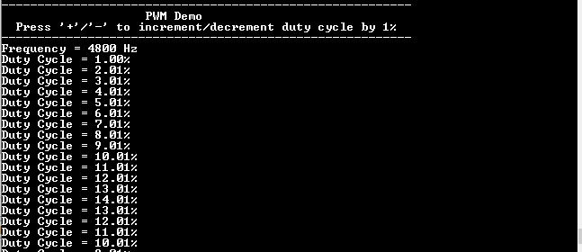

# PWM Duty Cycle

This example application demonstrates how to generate PWM output using the PWM peripheral.

## Description

This example application demonstrates how to use the PWM peripheral to generate a PWM signal and vary the duty cycle at run time. The demo is initially configured to generate a PWM output of 4800 Hz frequency and a duty cycle of 1%. At run time, based on the user input on the console, the duty cycle is incremented or decremented in steps of 1% while keeping the frequency of PWM output same.

## Downloading and building the application

To clone or download this application from Github, go to the [main page of this repository](https://github.com/Microchip-MPLAB-Harmony/csp_apps_cec173x) and then click **Clone** button to clone this repository or download as zip file.
This content can also be downloaded using content manager by following these [instructions](https://github.com/Microchip-MPLAB-Harmony/contentmanager/wiki).

Path of the application within the repository is **apps/pwm/pwm_duty_cycle/firmware** .

To build the application, refer to the following table and open the project using its IDE.

| Project Name      | Description                                    |
| ----------------- | ---------------------------------------------- |
| cec1736_evb.X | MPLABX project for [CEC 1736 Development Board](https://www.microchip.com/en-us/development-tool/EV19K07A)     |

## Setting up the hardware

The following table shows the target hardware for the application projects.

| Project Name| Board|
|:---------|:---------:|
| cec1736_evb.X | MPLABX project for [CEC 1736 Development Board](https://www.microchip.com/en-us/development-tool/EV19K07A)   |

### Setting up [CEC 1736 Development Board](https://www.microchip.com/en-us/development-tool/EV19K07A)

- GPIO053 is configured as the PWM output pin and is available on Pin 20 of P4 connector. Connect a logic analyzer or an oscilloscope to observe the PWM output.
- Connect the USB port P2 on the board to the computer using a micro USB cable

## Running the Application

1. Open the Terminal application (Ex.:Tera term) on the computer
2. Connect to the Virtual COM port and configure the serial settings as follows:
    - Baud : 115200
    - Data : 8 Bits
    - Parity : None
    - Stop : 1 Bit
    - Flow Control : None
3. Build and Program the application using its IDE
4. The console displays the following message

    
5. Verify the initial PWM output frequency is 4800 Hz and the duty cycle is 1%.
6. Press '+' on the console to increment the duty cycle by 1%. Press '-' to decrement the duty cycle by 1%.
7. Verify that the duty cycle measured by the logic analyzer is same as that mentioned on the console.    